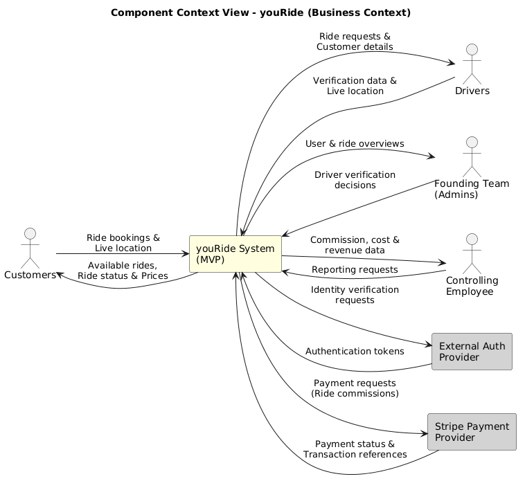
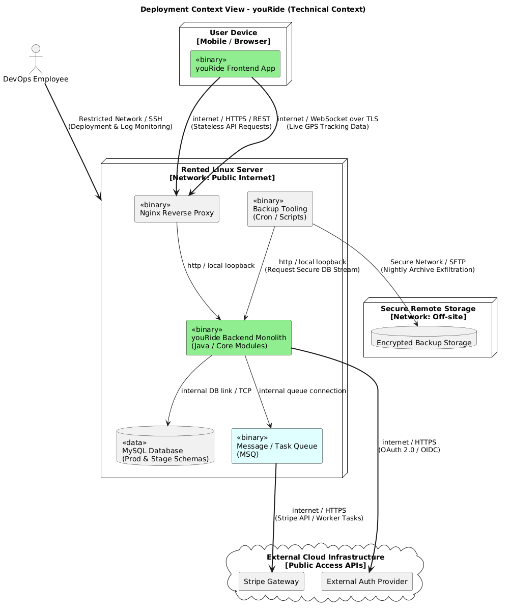
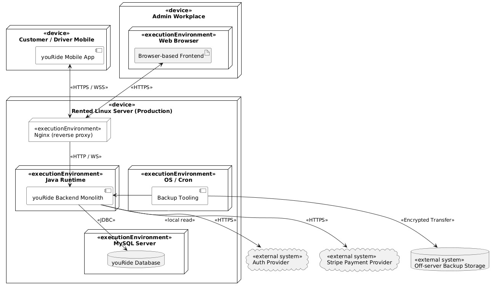
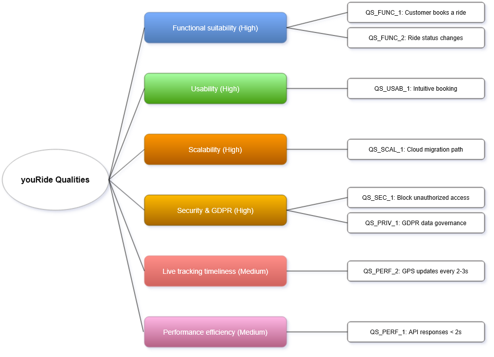

# youRide Architecture Documentation

**About arc42**

arc42, the template for documentation of software and system
architecture.

Template Version 8.2 EN. (based upon AsciiDoc version), January 2023

Created, maintained and © by Dr. Peter Hruschka, Dr. Gernot Starke and
contributors. See <https://arc42.org>.

This version of the template contains some help and explanations. It is
used for familiarization with arc42 and the understanding of the
concepts. For documentation of your own system you use better the
*plain* version.

# Introduction and Goals

Describes the relevant requirements and the driving forces that software
architects and development team must consider. These include

-   underlying business goals,

-   essential features,

-   essential functional requirements,

-   quality goals for the architecture and

-   relevant stakeholders and their expectations

This document describes the architecture of youRide, an Austrian ride
sharing application created by a small startup team. The system provides
an affordable and convenient transportation option while focusing on a
lean MVP, fast market entry, paying customers, and cost-efficient
operation.

## Requirements Overview

**Contents**

Short description of the functional requirements, driving forces,
extract (or abstract) of requirements. Link to (hopefully existing)
requirements documents (with version number and information where to
find it).

**Motivation**

From the point of view of the end users a system is created or modified
to improve support of a business activity and/or improve the quality.

**Form**

Short textual description, probably in tabular use-case format. If
requirements documents exist this overview should refer to these
documents.

Keep these excerpts as short as possible. Balance readability of this
document with potential redundancy w.r.t to requirements documents.

See [Introduction and Goals](https://docs.arc42.org/section-1/) in the
arc42 documentation.

**Project-specific content**

### Business Goals

youRide connects customers who need transportation with private or
professional drivers who can offer rides. The application starts in
Austria and positions itself as a local and cheaper alternative to large
international ride sharing providers.

The main business goal is to gain paying customers as quickly as
possible and become profitable with low operating costs. Future investor
interest is expected to follow from growth in active customers, active
drivers, completed rides, and controlled infrastructure costs. The
business model for the MVP is based on commissions per completed ride;
additional revenue streams are not part of the initial scope.

| ID | Business Goal | Description |
|----|---------------|-------------|
| BG_1 | Fast market entry | Build a useful MVP quickly in order to validate the Austrian market. |
| BG_2 | Paying customers | Win active customers and drivers and generate revenue through commissions per completed ride. |
| BG_3 | Low operating costs | Keep infrastructure and tool costs low because the founders provide and acquire the initial capital themselves. |
| BG_4 | Local alternative | Offer an Austrian ride sharing alternative that is cheaper than large international providers. |
| BG_5 | Measurable growth | Track active customers, active drivers, completed rides, and operating costs as main success indicators. |

### Functional Requirements Overview

The MVP supports spontaneous ride booking as well as planned shared
rides for a later time. Customers and drivers use separate account types,
because both groups have different workflows and data requirements.

| ID | Essential Feature | Description |
|----|-------------------|-------------|
| REQ_1 | Register account | Customers and drivers can create separate accounts and access the application. |
| REQ_2 | Verify driver | The company can verify drivers before they offer rides on the platform. |
| REQ_3 | Search for rides | Customers can search for available spontaneous or planned rides that match their travel needs. |
| REQ_4 | Book a ride | Customers can request or book a ride and receive a calculated ride price before the ride starts. |
| REQ_5 | Match driver automatically | The system automatically matches a suitable driver to a customer request. |
| REQ_6 | Accept or decline ride request | Drivers can accept or decline incoming ride requests. |
| REQ_7 | Track ride | Customers and drivers can track the ride with live GPS on a map and the status values requested, accepted, in progress, completed, or cancelled. |
| REQ_8 | Cancel ride | Customers and drivers can cancel a ride before completion. |
| REQ_9 | Complete ride and process payment | Drivers and customers can complete a ride once the trip has finished, and payment is processed through the external payment provider. |
| REQ_10 | View ride history | Customers and drivers can view previously completed or cancelled rides. |
| REQ_11 | Administer MVP | The founding team can review users, verify drivers, inspect rides, and access basic operational data. |

### Requirements Sources

The requirements overview is based on the existing project documents in
the `ridesharing` folder. The table above summarizes the most important
requirements for architecture work; detailed use-case descriptions remain
in the referenced documents.

| Document | Purpose |
|----------|---------|
| `ridesharing/brd.md` | Business goals, scope, functional requirements, non-functional requirements, assumptions, and constraints. |
| `ridesharing/use-case-document.md` | Actors, use cases, preconditions, postconditions, and user interactions for the MVP. |
| `ridesharing/investor-interview.md` | Investor expectations, market opportunity, return expectations, and business risks. |

## Quality Goals

**Contents**

The top three (max five) quality goals for the architecture whose
fulfillment is of highest importance to the major stakeholders. We
really mean quality goals for the architecture. Don’t confuse them with
project goals. They are not necessarily identical.

Consider this overview of potential topics (based upon the ISO 25010
standard):

**Motivation**

You should know the quality goals of your most important stakeholders,
since they will influence fundamental architectural decisions. Make sure
to be very concrete about these qualities, avoid buzzwords. If you as an
architect do not know how the quality of your work will be judged…

**Form**

A table with quality goals and concrete scenarios, ordered by priorities

**Project-specific content**

The following quality goals are ordered by priority and drive the main
architectural decisions.

| ID | Priority | Quality Goal | Motivation | Concrete Scenario |
|----|----------|--------------|------------|-------------------|
| QG_1 | 1 | Functional suitability | Price calculations, driver matching, ride data, location data, ride status changes, and communication between drivers and customers must work correctly and reliably. | When a customer books a ride, the system calculates a price, assigns a suitable driver, stores the ride, and shows the same ride status to customer and driver. |
| QG_2 | 2 | Usability | The application must be intuitive and usable without documentation for customers and drivers, because an easy-to-use platform helps win early users and supports fast startup growth. | A new customer can register, search for a ride, see the price, and request the ride without reading external instructions. |
| QG_3 | 3 | Scalability | The system must support growth in active customers, active drivers, completed rides, and later cloud usage, without creating high initial infrastructure costs. | When demand grows beyond the rented Linux server, the architecture allows migration of selected infrastructure parts to cloud services while keeping the server available for backup. |

## Stakeholders

**Contents**

Explicit overview of stakeholders of the system, i.e. all person, roles
or organizations that

-   should know the architecture

-   have to be convinced of the architecture

-   have to work with the architecture or with code

-   need the documentation of the architecture for their work

-   have to come up with decisions about the system or its development

**Motivation**

You should know all parties involved in development of the system or
affected by the system. Otherwise, you may get nasty surprises later in
the development process. These stakeholders determine the extent and the
level of detail of your work and its results.

**Form**

Table with role names, person names, and their expectations with respect
to the architecture and its documentation.

| Role/Name   | Contact        | Expectations       |
|-------------|----------------|--------------------|
| *\<Role-1>* | *\<Contact-1>* | *\<Expectation-1>* |
| *\<Role-2>* | *\<Contact-2>* | *\<Expectation-2>* |

**Project-specific content**

The following stakeholders influence the architecture and the required
level of detail in this documentation.

| Role/Name | Contact | Expectations |
|-----------|---------|--------------|
| Entrepreneurs / developers | Founding team | A cost-efficient MVP, fast implementation, simple deployment, low operating costs, and an architecture that can later be scaled and split into microservices if growth requires it. |
| Customers | - | Affordable and convenient transportation, simple ride booking for immediate or planned rides, transparent prices, live ride status, and a good user interface experience. |
| Drivers | - | Intuitive application, clear ride requests, reliable customer communication, live ride status, and a good price-to-earnings ratio. |
| DevOps / network employee | Internal employee | Reliable deployment, stable server and network operation, monitoring, backups, and a technical setup that can later integrate cloud services. |
| Controlling employee | Internal employee | Cost overview, revenue data, ride-based commission reporting, and basic operational reporting for business decisions. |

# Architecture Constraints

**Contents**

Any requirement that constraints software architects in their freedom of
design and implementation decisions or decision about the development
process. These constraints sometimes go beyond individual systems and
are valid for whole organizations and companies.

**Motivation**

Architects should know exactly where they are free in their design
decisions and where they must adhere to constraints. Constraints must
always be dealt with; they may be negotiable, though.

**Form**

Simple tables of constraints with explanations. If needed you can
subdivide them into technical constraints, organizational and political
constraints and conventions (e.g. programming or versioning guidelines,
documentation or naming conventions)

See [Architecture Constraints](https://docs.arc42.org/section-2/) in the
arc42 documentation.

**Project-specific content**

The following constraints limit the architectural freedom for the first
release of youRide. They are separated from architecture decisions, so
that later decisions can be traced back to the actual restrictions.

| ID | Category | Constraint | Background and Motivation | Architectural Consequence |
|----|----------|------------|---------------------------|---------------------------|
| C_1 | Budget / operational | The initial production system runs on a rented Linux server. | This keeps fixed infrastructure costs low for the startup during the MVP phase. | The initial deployment must be simple enough to run on one server and must not depend on a complex cloud setup. |
| C_2 | Budget | Recurring infrastructure and tool costs must be kept as low as reasonably possible. | The founders provide and acquire the initial capital themselves. | The architecture must favor a lean MVP, avoid unnecessary paid services, and keep operating costs visible. |
| C_3 | Operational / scalability | Cloud services are used later when scaling becomes necessary; the rented server remains available for backup purposes. | The startup wants to start cheaply but still keep a growth path for increasing customer, driver, and ride numbers. | The system must avoid unnecessary vendor lock-in and keep deployment, data export, and backup concepts compatible with a later cloud migration. |
| C_4 | Organizational | The initial company team consists of three entrepreneurs/developers, one DevOps/network employee, and one controlling employee. | Development, operations, networking, and financial control are handled by a small internal team. | The architecture, deployment process, monitoring, and documentation must be understandable and maintainable by a small team. |
| C_5 | Compliance | Data governance is based on GDPR. | Customer profiles, driver profiles, ride data, and location data are personal data. | Privacy, security, retention, access control, and deletion concepts must respect GDPR principles from the beginning. |

### Non-constraints

The chosen technologies, such as Java, Angular, MySQL, and REST APIs,
are current architecture decisions and not externally mandated
constraints. They will be justified in the solution strategy and
architecture decisions sections.

# System Scope and Context

**Contents**

System scope and context - as the name suggests - delimits your system
(i.e. your scope) from all its communication partners (neighboring
systems and users, i.e. the context of your system). It thereby
specifies the external interfaces.

If necessary, differentiate the business context (domain specific inputs
and outputs) from the technical context (channels, protocols, hardware).

**Motivation**

The domain interfaces and technical interfaces to communication partners
are among your system’s most critical aspects. Make sure that you
completely understand them.

**Form**

Various options:

-   Context diagrams

-   Lists of communication partners and their interfaces.

See [Context and Scope](https://docs.arc42.org/section-3/) in the arc42
documentation.

**Project-specific content**

For this documentation, the youRide system boundary includes the mobile
app/frontend, the backend monolith, the MySQL database, and the admin
functions used by the founding team. External systems are limited to an
external authentication provider and the payment provider Stripe in the
MVP. Map display, ride matching, live tracking, reporting, and
administration are treated as youRide functionality.

## Business Context

**Contents**

Specification of **all** communication partners (users, IT-systems, …)
with explanations of domain specific inputs and outputs or interfaces.
Optionally you can add domain specific formats or communication
protocols.

**Motivation**

All stakeholders should understand which data are exchanged with the
environment of the system.

**Form**

All kinds of diagrams that show the system as a black box and specify
the domain interfaces to communication partners.

Alternatively (or additionally) you can use a table. The title of the
table is the name of your system, the three columns contain the name of
the communication partner, the inputs, and the outputs.

**Project-specific content**

The following table shows youRide as a black box and lists the external
communication partners and the domain-specific information exchanged
with them.

| Communication Partner | Input to youRide | Output from youRide |
|-----------------------|------------------|---------------------|
| Customers | Registration data, login requests, pickup and destination, ride search criteria, booking requests, cancellation requests, live location data, ride completion confirmation. | Available rides or matched driver, calculated price, booking confirmation, ride status, live ride location, ride history. |
| Drivers | Registration data, login requests, driver verification data, ride availability, accept or decline decisions, live location data, cancellation requests, ride completion confirmation. | Ride requests, customer pickup and destination, calculated ride information, ride status, customer communication, ride history. |
| Founding team / administrators | Driver verification decisions, user review actions, ride inspection requests, operational corrections. | User overview, driver verification status, ride overview, basic operational data. |
| Controlling employee | Reporting requests and cost or revenue analysis requests. | Ride-based commission data, revenue data, cost overview, and basic operational reports. |
| External authentication provider | Registration and login requests, identity verification requests. | Authentication result, user identity information, and authentication tokens. |
| Stripe payment provider | Payment request, ride price, payer and payee references, payment confirmation request. | Payment status, transaction reference, and payment confirmation or failure information. |

There are no additional external business partners such as authorities,
insurance providers, or transportation agencies in the MVP scope.

## Technical Context

**Contents**

Technical interfaces (channels and transmission media) linking your
system to its environment. In addition a mapping of domain specific
input/output to the channels, i.e. an explanation which I/O uses which
channel.

**Motivation**

Many stakeholders make architectural decision based on the technical
interfaces between the system and its context. Especially infrastructure
or hardware designers decide these technical interfaces.

**Form**

E.g. UML deployment diagram describing channels to neighboring systems,
together with a mapping table showing the relationships between channels
and input/output.

**Project-specific content**

The MVP uses simple and well-known technical interfaces to keep
implementation and operation manageable for the small team. Normal app
operations use HTTPS/REST. Live ride tracking uses WebSocket
communication because both driver and customer need timely location and
status updates during an active ride. Payment processing is decoupled
through an internal durable message queue so that temporary network
errors, Stripe outages, or backend retries do not lose payment requests.

| Technical Interface | Communication Partner / Target | Channel / Protocol | Purpose |
|---------------------|--------------------------------|--------------------|---------|
| Mobile app to backend | youRide backend monolith | HTTPS/REST over public internet | Registration, login handoff, ride search, booking, cancellation, ride completion, ride history, and admin-related requests. |
| Live tracking channel | youRide backend monolith | WebSocket over TLS | Driver and customer live location updates and ride status changes during an active ride. |
| Backend to database | MySQL database | Internal database connection on the rented Linux server or private network | Store and read customer profiles, driver profiles, rides, ride status, prices, payment references, and reporting data. |
| Backend to authentication provider | External authentication provider | HTTPS, based on standard authentication protocols such as OAuth 2.0 / OpenID Connect | Register users, authenticate users, and validate identity information. |
| Backend to payment queue | Internal payment message queue | Durable internal queue, for example AMQP / RabbitMQ or a comparable managed queue | Store payment requests reliably before provider communication, so payments can be retried after temporary network, provider, or backend errors. |
| Payment worker to Stripe | Stripe payment provider | HTTPS / Stripe API with retries and idempotency keys | Process queued payment requests, retrieve payment status, and store payment references for ride commissions. |
| DevOps access | Rented Linux server | Secure administrative access, e.g. SSH via restricted network access | Deployment, monitoring, backup handling, and operational maintenance. |

The detailed physical deployment of the rented server, database,
networking, backup, and later cloud migration path is described in the
deployment view.

**Mapping Input/Output to Channels**

| Domain Input/Output | Technical Channel |
|---------------------|-------------------|
| Registration, ride search, booking, cancellation, completion, ride history | Mobile app to backend via HTTPS/REST. |
| Live GPS location and active ride status | WebSocket over TLS between mobile app and backend. |
| Authentication result and user identity | Backend to external authentication provider via HTTPS. |
| Payment request and retry state | Backend to internal payment message queue through a durable queue channel. |
| Payment confirmation and transaction reference | Payment worker to Stripe via HTTPS / Stripe API, with the result persisted in youRide. |
| Stored customer, driver, ride, price, payment, and reporting data | Backend to MySQL via internal database connection. |

# Solution Strategy

**Contents**

A short summary and explanation of the fundamental decisions and
solution strategies, that shape system architecture. It includes

-   technology decisions

-   decisions about the top-level decomposition of the system, e.g.
    usage of an architectural pattern or design pattern

-   decisions on how to achieve key quality goals

-   relevant organizational decisions, e.g. selecting a development
    process or delegating certain tasks to third parties.

**Motivation**

These decisions form the cornerstones for your architecture. They are
the foundation for many other detailed decisions or implementation
rules.

**Form**

Keep the explanations of such key decisions short.

Motivate what was decided and why it was decided that way, based upon
problem statement, quality goals and key constraints. Refer to details
in the following sections.

See [Solution Strategy](https://docs.arc42.org/section-4/) in the arc42
documentation.

**Project-specific content**

The following solution strategies form the cornerstones of the
architecture and provide the basis for more detailed implementation
decisions.

| Goal / Requirement | Architectural Approach | Rationale / Linked Constraints and Goals |
|--------------------|------------------------|------------------------------------------|
| Fast market entry and low operating costs (`BG_1`, `BG_3`, `C_1`, `C_2`) | Build the MVP as a modular monolith. The system is deployed as one backend application, but internally structured into clear modules such as identity, ride management, payment integration, tracking, and administration. | A modular monolith keeps deployment and operations simple for the small team while still supporting maintainability through internal boundaries. |
| Familiar and productive technology stack | Use Java for the backend monolith, Angular for the frontend, MySQL for persistence, REST APIs for normal app communication, and WebSocket communication for live tracking. | These technologies are established, affordable, and suitable for the planned MVP scope. They also support the chosen client-server and monolithic architecture. |
| External authentication and payment (`REQ_1`, `REQ_4`, `REQ_9`, `C_2`) | Use an external authentication provider and Stripe as external payment provider. Payment requests are handed off through an internal durable queue before Stripe communication. | Authentication and payment are complex and security-critical. Delegating them reduces implementation effort and risk for the startup, while queued payment handoff reduces the effect of temporary network or provider errors. |
| Cost-efficient deployment and later scalability (`QG_3`, `C_1`, `C_3`) | Start on a rented Linux server. When demand grows, add cloud services for scaling while keeping the rented server available for backup purposes. | This keeps initial costs low but leaves a realistic growth path for increasing customer, driver, and ride numbers. |
| Functional suitability and reliability (`QG_1`) | Use unit tests and integration tests for important business logic and external interfaces. | Price calculation, ride status changes, matching, persistence, authentication handoff, and payment integration must work reliably. |
| Security and data protection (`C_5`) | Use penetration tests and GDPR-oriented data governance. | Customer, driver, ride, location, and payment reference data require careful protection from the beginning. |

# Building Block View

**Content**

The building block view shows the static decomposition of the system
into building blocks (modules, components, subsystems, classes,
interfaces, packages, libraries, frameworks, layers, partitions, tiers,
functions, macros, operations, data structures, …) as well as their
dependencies (relationships, associations, …)

This view is mandatory for every architecture documentation. In analogy
to a house this is the *floor plan*.

**Motivation**

Maintain an overview of your source code by making its structure
understandable through abstraction.

This allows you to communicate with your stakeholder on an abstract
level without disclosing implementation details.

**Form**

The building block view is a hierarchical collection of black boxes and
white boxes (see figure below) and their descriptions.

**Level 1** is the white box description of the overall system together
with black box descriptions of all contained building blocks.

**Level 2** zooms into some building blocks of level 1. Thus it contains
the white box description of selected building blocks of level 1,
together with black box descriptions of their internal building blocks.

**Level 3** zooms into selected building blocks of level 2, and so on.

See [Building Block View](https://docs.arc42.org/section-5/) in the
arc42 documentation.

## Whitebox Overall System

Here you describe the decomposition of the overall system using the
following white box template. It contains

-   an overview diagram

-   a motivation for the decomposition

-   black box descriptions of the contained building blocks. For these
    we offer you alternatives:

    -   use *one* table for a short and pragmatic overview of all
        contained building blocks and their interfaces

    -   use a list of black box descriptions of the building blocks
        according to the black box template (see below). Depending on
        your choice of tool this list could be sub-chapters (in text
        files), sub-pages (in a Wiki) or nested elements (in a modeling
        tool).

-   (optional:) important interfaces, that are not explained in the
    black box templates of a building block, but are very important for
    understanding the white box. Since there are so many ways to specify
    interfaces why do not provide a specific template for them. In the
    worst case you have to specify and describe syntax, semantics,
    protocols, error handling, restrictions, versions, qualities,
    necessary compatibilities and many things more. In the best case you
    will get away with examples or simple signatures.

**Project-specific content**

### Overview Diagram

The Level 1 overview diagram is maintained in `building-blocks.puml`.
It shows youRide as a complete system with mobile app/frontend, backend
monolith, database, and the two external providers for authentication
and payment.

### Motivation

The decomposition follows the selected modular monolith strategy. The
mobile app/frontend is separated from the backend so that user
interaction stays independent from business logic. The backend monolith
contains the core business capabilities and is deployed as one
application to keep operation simple for the startup. MySQL is separated
as the persistent data store. Payment requests are first written to an
internal durable message queue and then processed by a payment worker.
Authentication and payment execution are delegated to external providers
because they are security-critical and costly to implement from scratch.

### Contained Building Blocks and Important External Systems

| Name | Type | Responsibility | Interfaces | Fulfilled Requirements |
|------|------|----------------|------------|------------------------|
| youRide Mobile App / Frontend | Contained building block | Provides the user interface for customers, drivers, administrators, and controlling. It supports registration, driver verification, ride search, booking, live tracking, cancellations, ride completion, ride history, administration, and reporting access. | HTTPS/REST and WebSocket/TLS to the backend monolith. | `REQ_1`, `REQ_2`, `REQ_3`, `REQ_4`, `REQ_6`, `REQ_7`, `REQ_8`, `REQ_9`, `REQ_10`, `REQ_11` |
| youRide Backend Monolith | Contained building block | Implements the central application logic for identity integration, customer and driver management, driver verification, ride matching, ride status handling, live tracking, payment integration, administration, and reporting. | HTTPS/REST and WebSocket/TLS for the frontend, HTTPS to the authentication provider, durable payment queue access, and internal database connection to MySQL. | `REQ_1` to `REQ_11` |
| MySQL Database | Contained building block | Stores customer profiles, driver profiles, verification status, ride data, ride status, calculated prices, payment references, and reporting data. | Internal database connection from the backend monolith. | `REQ_1`, `REQ_2`, `REQ_3`, `REQ_4`, `REQ_5`, `REQ_6`, `REQ_7`, `REQ_8`, `REQ_9`, `REQ_10`, `REQ_11` |
| Internal Payment Message Queue | Contained building block | Durably stores payment requests, retry metadata, and idempotency information until the payment worker can process them. | Internal durable queue channel used by Payment Integration and the Payment Worker. | `REQ_9`, `BG_2`, `QG_1` |
| External Auth Provider | External system | Handles registration, login, authentication, and token issuing for customer, driver, and internal users. | HTTPS, based on standard authentication protocols such as OAuth 2.0 / OpenID Connect. | `REQ_1` |
| Stripe Payment Provider | External system | Processes queued ride payments and returns payment status and transaction references. | HTTPS / Stripe API used by the payment worker. | `REQ_9`, `BG_2` |

### Important Interfaces

| Interface | Description |
|-----------|-------------|
| Frontend REST API | Main interface for registration handoff, ride search, booking, cancellation, completion, ride history, administration, and reporting requests. |
| Live Tracking Channel | WebSocket/TLS channel for active ride status and live GPS updates between frontend and backend. |
| Authentication Provider API | External interface used by the backend to validate user identity and authentication tokens. |
| Payment Queue | Internal durable queue used to store payment requests before provider communication and to support retries after temporary failures. |
| Stripe API | External payment interface used by the payment worker to process queued ride payments and retrieve payment references. |
| Database Access | Internal persistence interface between backend monolith and MySQL. |

## Level 2

Here you can specify the inner structure of (some) building blocks from
level 1 as white boxes.

You have to decide which building blocks of your system are important
enough to justify such a detailed description. Please prefer relevance
over completeness. Specify important, surprising, risky, complex or
volatile building blocks. Leave out normal, simple, boring or
standardized parts of your system

### White Box youRide Backend Monolith

The backend monolith is refined on Level 2 because it contains the most
important business logic and the main architectural risks. The mobile
app/frontend, MySQL database, and external providers remain black boxes
on this level because their internal structure is either less critical
for the MVP architecture or outside the youRide implementation scope.

| Name | Responsibility | Main Collaborators |
|------|----------------|--------------------|
| Identity / Auth Integration | Integrates with the external authentication provider, validates authentication tokens, and maps authenticated users to customer, driver, or internal roles. | External Auth Provider, Customer Management, Driver Management & Verification, Administration & Reporting |
| Customer Management | Manages customer profile data and customer-specific ride access. | Identity / Auth Integration, Ride Management & Matching, Persistence |
| Driver Management & Verification | Manages driver profile data, driver availability, and driver verification status before drivers can offer rides. | Identity / Auth Integration, Ride Management & Matching, Administration & Reporting, Persistence |
| Ride Management & Matching | Handles ride requests, automatic driver matching, calculated prices, ride status transitions, cancellation, completion, and ride history. | Customer Management, Driver Management & Verification, Live Tracking, Payment Integration, Persistence |
| Live Tracking | Processes live GPS updates and distributes active ride status and location updates to customer and driver. | Ride Management & Matching, Mobile App / Frontend |
| Payment Integration | Creates durable payment requests, writes them to the internal payment queue, coordinates the payment worker, and stores payment references and payment status. | Ride Management & Matching, Internal Payment Message Queue, Stripe Payment Provider, Persistence |
| Administration & Reporting | Supports founder/admin operations, driver verification decisions, ride inspection, basic revenue data, commission reporting, and cost overview. | Driver Management & Verification, Ride Management & Matching, Payment Integration, Persistence |
| Persistence | Provides database access for the backend modules and isolates MySQL access from business logic. | MySQL Database, all backend modules |

### Level 2 Interfaces

| Interface | Description |
|-----------|-------------|
| Application API | REST endpoints exposed by the backend monolith for frontend use cases. |
| Tracking API | WebSocket/TLS endpoint for live ride location and ride status updates. |
| Module-internal services | Internal Java service interfaces between backend modules. They keep module boundaries explicit inside the monolith. |
| Repository interfaces | Internal persistence interfaces used by backend modules to access stored data through the Persistence module. |

## Level 3

Here you can specify the inner structure of (some) building blocks from
level 2 as white boxes.

When you need more detailed levels of your architecture please copy this
part of arc42 for additional levels.

### White Box Ride Management & Matching

Ride Management & Matching is refined on Level 3 because it is the core
business module of youRide. It supports the most important MVP
requirements: ride search, booking, automatic driver matching, ride
status handling, cancellation, completion, ride history, and the payment
handoff.

A class-diagram style model for this Level 3 view is maintained in
`Building-Block-View/level3.md`.

### Motivation

This module must keep the ride lifecycle consistent. Customers and
drivers must see the same ride state, price, and matching result. The
module also coordinates with Driver Management & Verification, Live
Tracking, Payment Integration, and Persistence. Therefore, its internal
structure is more relevant than the internal structure of simpler or
external building blocks.

### Internal Building Blocks

| Name | Responsibility | Main Collaborators |
|------|----------------|--------------------|
| Ride Application Service | Orchestrates ride use cases such as search, request, accept, cancel, start, complete, and history access. | Application API, Ride Aggregate, Matching Service, Price Calculation, Ride Repository Port, Payment Integration |
| Ride Aggregate | Represents one ride and protects ride invariants such as customer, driver, pickup, destination, price, payment reference, and current status. | Ride Application Service, Ride Status Policy |
| Matching Service | Selects a suitable verified and available driver for a ride request. | Driver Management & Verification, Live Tracking, Ride Application Service |
| Price Calculation | Calculates the ride price before booking and provides the price used for the later payment request. | Ride Application Service, Persistence |
| Ride Status Policy | Validates allowed status transitions, for example from `requested` to `accepted` or from `in progress` to `completed`. | Ride Aggregate, Ride Application Service |
| Ride Repository Port | Defines persistence operations for ride requests, status changes, prices, payment references, and ride history. | Persistence, MySQL Database |
| Payment Handoff | Coordinates ride completion with Payment Integration so that the payment request is durably queued before the ride is finally stored as completed. | Payment Integration, Ride Application Service |

### Important Interfaces

| Interface / Operation | Description |
|-----------------------|-------------|
| `searchRides(...)` | Returns ride options or availability information for spontaneous or planned rides. |
| `requestRide(customerId, pickup, destination, time)` | Creates a ride request, calculates a price, matches a driver, and stores the ride with status `requested`. |
| `acceptRide(rideId, driverId)` | Validates the assigned driver and changes the ride status to `accepted`. |
| `startRide(rideId)` | Changes the ride status to `in progress` when the ride begins. |
| `cancelRide(rideId, actorId)` | Cancels a ride when the current status allows cancellation. |
| `completeRide(rideId)` | Completes a ride after the payment request has been durably queued through Payment Integration. |
| `getRideHistory(userId)` | Returns completed or cancelled rides for customer or driver history views. |

### Ride Status Transitions

| Current Status | Trigger | Next Status | Notes |
|----------------|---------|-------------|-------|
| `requested` | Matching result is available and driver accepts the request. | `accepted` | Driver must be verified and allowed to accept the ride. |
| `requested` | Customer or system cancels before acceptance. | `cancelled` | No payment is processed. |
| `accepted` | Driver and customer start the ride. | `in progress` | Live tracking continues through the Live Tracking module. |
| `accepted` | Customer or driver cancels before the ride starts. | `cancelled` | Cancellation is stored for ride history and reporting. |
| `in progress` | Ride reaches the destination and the payment request is durably queued. | `completed` | Payment status can remain `pending` or `retrying` until the payment worker stores the Stripe payment reference. |
| `in progress` | Exceptional cancellation during the ride. | `cancelled` | Requires business rules for later refinement. |

### Quality and Risk Notes

-   Supports `REQ_3` to `REQ_10`, `QG_1`, `QG_2`, and `QG_3`.
-   Direct database access is avoided through the Ride Repository Port.
-   Payment details are delegated to Payment Integration, the internal
    payment queue, the payment worker, and Stripe.
-   The module must be kept cohesive because it is a major risk area for
    monolith complexity and scaling limitations.

# Runtime View

**Contents**

The runtime view describes concrete behavior and interactions of the
system’s building blocks in form of scenarios from the following areas:

-   important use cases or features: how do building blocks execute
    them?

-   interactions at critical external interfaces: how do building blocks
    cooperate with users and neighboring systems?

-   operation and administration: launch, start-up, stop

-   error and exception scenarios

Remark: The main criterion for the choice of possible scenarios
(sequences, workflows) is their **architectural relevance**. It is
**not** important to describe a large number of scenarios. You should
rather document a representative selection.

**Motivation**

You should understand how (instances of) building blocks of your system
perform their job and communicate at runtime. You will mainly capture
scenarios in your documentation to communicate your architecture to
stakeholders that are less willing or able to read and understand the
static models (building block view, deployment view).

**Form**

There are many notations for describing scenarios, e.g.

-   numbered list of steps (in natural language)

-   activity diagrams or flow charts

-   sequence diagrams

-   BPMN or EPCs (event process chains)

-   state machines

-   …

See [Runtime View](https://docs.arc42.org/section-6/) in the arc42
documentation.

**Project-specific content**

The following runtime scenarios describe the most relevant MVP workflows
on architecture level. They focus on interactions between the building
blocks from the building block view.

## Runtime Scenario 1: Customer Books a Ride with Automatic Driver Matching

1. The customer enters pickup, destination, and desired time in the
   youRide Mobile App / Frontend.
2. The frontend sends the ride request to the backend monolith via the
   Frontend REST API.
3. Identity / Auth Integration validates the customer's authentication
   token with the external authentication provider.
4. Ride Management & Matching validates the request data and asks Driver
   Management & Verification for verified and available drivers.
5. Ride Management & Matching calculates the ride price and selects a
   suitable driver automatically.
6. Persistence stores the ride request, calculated price, selected
   driver, and initial ride status.
7. The backend returns the booking result to the frontend.
8. The customer sees the calculated price, matched driver information,
   and current ride status.

Notable aspects:

-   The scenario supports `REQ_3`, `REQ_4`, and `REQ_5`.
-   Authentication is external, but ride matching and price calculation
    remain core youRide functionality.
-   The ride is stored before later status changes are processed, so the
    ride history and reporting data can be derived from persistent state.

## Runtime Scenario 2: Driver Accepts Ride and Live Tracking Starts

1. The driver receives the ride request in the youRide Mobile App /
   Frontend.
2. The driver accepts the ride request.
3. The frontend sends the accept decision to the backend monolith via the
   Frontend REST API.
4. Identity / Auth Integration validates the driver's authentication
   token.
5. Ride Management & Matching checks that the ride is still open and
   that the driver is allowed to accept it.
6. Persistence stores the ride status as `accepted`.
7. The frontend opens the live tracking channel to the backend via
   WebSocket/TLS.
8. Live Tracking receives driver GPS updates and distributes active ride
   status and location information to the customer and driver frontend.
9. When the ride starts, Ride Management & Matching changes the ride
   status to `in progress` and Persistence stores the status change.

Notable aspects:

-   The scenario supports `REQ_6` and `REQ_7`.
-   REST is used for the accept command, while WebSocket/TLS is used for
    continuous live tracking updates.
-   Ride status changes are persisted so that both customer and driver
    see the same current state.

## Runtime Scenario 3: Ride is Completed and Payment is Processed

1. The driver or customer confirms that the ride has reached the
   destination.
2. The frontend sends the completion request to the backend monolith via
   the Frontend REST API.
3. Identity / Auth Integration validates the authenticated user.
4. Ride Management & Matching checks that the ride is currently `in
   progress` and can be completed.
5. Payment Integration creates a payment request with the ride price,
   payment references, retry metadata, and an idempotency key.
6. Payment Integration writes the payment request to the internal durable
   payment queue.
7. Ride Management & Matching changes the ride status to `completed`
   after the queue confirms durable storage of the payment request.
8. Persistence stores the completed ride, final ride status, payment
   status `pending`, and data needed for ride history and controlling
   reports.
9. The payment worker reads the queued payment request and calls Stripe
   through HTTPS / Stripe API with the idempotency key.
10. Stripe returns the payment status and transaction reference, or the
    payment worker keeps the request queued for retry after temporary
    network or provider errors.
11. Payment Integration stores the final payment reference and payment
    status through Persistence.
12. The frontend shows the completed ride and the current payment status
    to customer and driver.

Notable aspects:

-   The scenario supports `REQ_9`, `REQ_10`, and `BG_2`.
-   Stripe is the only external payment system in the MVP.
-   The ride can be completed after the payment request is durably
    queued; the payment status can remain `pending` or `retrying` until
    the payment worker receives a final Stripe result.
-   Payment result, ride status, and reporting data are persisted to
    support ride history and commission reporting.

# Deployment View

**Content**

The deployment view describes:

1.  technical infrastructure used to execute your system, with
    infrastructure elements like geographical locations, environments,
    computers, processors, channels and net topologies as well as other
    infrastructure elements and

2.  mapping of (software) building blocks to that infrastructure
    elements.

Often systems are executed in different environments, e.g. development
environment, test environment, production environment. In such cases you
should document all relevant environments.

Especially document a deployment view if your software is executed as
distributed system with more than one computer, processor, server or
container or when you design and construct your own hardware processors
and chips.

From a software perspective it is sufficient to capture only those
elements of an infrastructure that are needed to show a deployment of
your building blocks. Hardware architects can go beyond that and
describe an infrastructure to any level of detail they need to capture.

**Motivation**

Software does not run without hardware. This underlying infrastructure
can and will influence a system and/or some cross-cutting concepts.
Therefore, there is a need to know the infrastructure.

Maybe a highest level deployment diagram is already contained in section
3.2. as technical context with your own infrastructure as ONE black box.
In this section one can zoom into this black box using additional
deployment diagrams:

-   UML offers deployment diagrams to express that view. Use it,
    probably with nested diagrams, when your infrastructure is more
    complex.

-   When your (hardware) stakeholders prefer other kinds of diagrams
    rather than a deployment diagram, let them use any kind that is able
    to show nodes and channels of the infrastructure.

See [Deployment View](https://docs.arc42.org/section-7/) in the arc42
documentation.

## Infrastructure Level 1

Describe (usually in a combination of diagrams, tables, and text):

-   distribution of a system to multiple locations, environments,
    computers, processors, .., as well as physical connections between
    them

-   important justifications or motivations for this deployment
    structure

-   quality and/or performance features of this infrastructure

-   mapping of software artifacts to elements of this infrastructure

For multiple environments or alternative deployments please copy and
adapt this section of arc42 for all relevant environments.

**Project-specific content**

### Overview

The MVP is deployed with a cost-efficient three-environment setup:
development, test/staging, and production. Production initially runs on
one rented Linux server to satisfy the budget constraints `C_1` and
`C_2`. When demand grows, cloud services can be added later according to
constraint `C_3`.

| Environment | Infrastructure | Purpose |
|-------------|----------------|---------|
| Development | Local developer machines with local or test database instances. | Implementation, local testing, and debugging by the three entrepreneurs/developers. |
| Test / Staging | Separate staging setup on the rented Linux server, isolated from production by configuration, database/schema, ports, and access rules. | Integration testing, deployment rehearsal, and acceptance checks before production releases. |
| Production | Rented Linux server with Nginx, Java backend monolith, payment worker, internal payment message queue, MySQL database, and backup tooling. | Productive use by customers, drivers, founding team, and controlling. |

### Motivation

The deployment structure favors low cost and operational simplicity. All
productive server-side components run on one rented Linux server during
the MVP phase. Nginx acts as reverse proxy and TLS termination point.
The Java backend monolith and MySQL database run on the same server to
avoid additional infrastructure cost and complexity. The internal
payment message queue and payment worker also run on this server during
the MVP phase so payment requests survive temporary network or provider
failures. External authentication and Stripe remain outside the rented
server and are reached through HTTPS.

Customers and drivers use the mobile app. Internal administration and
controlling can be accessed through a browser-based frontend served by
the same frontend/application setup. This keeps the customer-facing
experience mobile-first while still allowing efficient internal work.

### Quality and Performance Features

| Concern | Infrastructure Measure |
|---------|------------------------|
| Cost efficiency | One rented Linux server hosts Nginx, backend, payment worker, payment queue, database, and staging/production setups for the MVP. |
| Security | Public access is routed through Nginx with TLS. Administrative access is restricted, e.g. via SSH and limited network access. |
| Reliability | Payment requests are stored in a durable internal queue before Stripe communication. Automated backups are created for the MySQL database, application configuration, and relevant deployment artifacts. |
| Recoverability | Backups are encrypted and copied to external off-server storage. Restore tests are performed regularly to verify that backups can actually be used. |
| Scalability path | If the rented server becomes insufficient, selected parts can later move to cloud services while the rented server remains available for backup purposes. |

### Mapping of Building Blocks to Infrastructure

| Building Block / Artifact | Deployment Target | Notes |
|---------------------------|-------------------|-------|
| youRide Mobile App / Frontend | Customer and driver mobile devices; internal browser clients for administration and controlling. | Mobile-first client for customers and drivers. Browser access is used for internal admin/reporting workflows. |
| Nginx Reverse Proxy | Rented Linux server | Handles HTTPS entry point, TLS termination, reverse proxying to the Java backend, and serving browser-based frontend assets if needed. |
| youRide Backend Monolith | Rented Linux server | Java application deployed as one backend artifact. |
| Payment Worker | Rented Linux server, initially as part of or next to the Java backend deployment | Processes queued payment requests, calls Stripe with retries and idempotency keys, and stores final payment status. |
| Internal Payment Message Queue | Rented Linux server | Durably stores payment requests and retry metadata until the payment worker can process them. |
| MySQL Database | Rented Linux server | Stores customer, driver, ride, payment reference, and reporting data. |
| Backup tooling | Rented Linux server plus external off-server backup storage | Creates encrypted database and configuration backups and copies them away from the production server. |
| External Auth Provider | External provider infrastructure | Used through HTTPS for authentication and identity management. |
| Stripe Payment Provider | Stripe infrastructure | Used through HTTPS / Stripe API by the payment worker for ride payments. |

## Infrastructure Level 2

Here you can include the internal structure of (some) infrastructure
elements from level 1.

Please copy the structure from level 1 for each selected element.

### Production Linux Server

The production server is the central infrastructure element during the
MVP phase.

| Infrastructure Element | Responsibility |
|------------------------|----------------|
| Nginx | Public HTTPS endpoint, reverse proxy to the backend, TLS handling, optional serving of browser-based frontend assets. |
| Java Backend Monolith | Executes youRide business logic, REST API, WebSocket/TLS tracking endpoint, provider integrations, and internal module logic. |
| Payment Worker | Processes durable payment queue messages, calls Stripe with retry and idempotency handling, and writes final payment status. |
| Internal Payment Message Queue | Durable local queue for payment requests that must survive temporary network, provider, or backend processing errors. |
| MySQL Database | Persistent storage for application data. |
| Backup tooling | Automated encrypted backups of database, configuration, and deployment-relevant files. |
| Monitoring / operational scripts | Basic health checks, log inspection, deployment support, and operational maintenance by the DevOps/network employee. |

### Backup Storage

Backups must not only remain on the production server. The standard
backup approach for this setup is:

1. Create automated MySQL backups and configuration backups.
2. Encrypt backup artifacts.
3. Store a local short-term copy for quick recovery.
4. Copy backups to external off-server storage.
5. Keep a simple retention policy, for example daily backups for recent
   recovery and weekly backups for longer recovery windows.
6. Perform regular restore tests.

This keeps the setup affordable while reducing the risk that a server
failure also destroys all backups.

# Cross-cutting Concepts

**Content**

This section describes overall, principal regulations and solution ideas
that are relevant in multiple parts (= cross-cutting) of your system.
Such concepts are often related to multiple building blocks. They can
include many different topics, such as

-   models, especially domain models

-   architecture or design patterns

-   rules for using specific technology

-   principal, often technical decisions of an overarching (=
    cross-cutting) nature

-   implementation rules

**Motivation**

Concepts form the basis for *conceptual integrity* (consistency,
homogeneity) of the architecture. Thus, they are an important
contribution to achieve inner qualities of your system.

Some of these concepts cannot be assigned to individual building blocks,
e.g. security or safety.

**Form**

The form can be varied:

-   concept papers with any kind of structure

-   cross-cutting model excerpts or scenarios using notations of the
    architecture views

-   sample implementations, especially for technical concepts

-   reference to typical usage of standard frameworks (e.g. using
    Hibernate for object/relational mapping)

**Structure**

A potential (but not mandatory) structure for this section could be:

-   Domain concepts

-   User Experience concepts (UX)

-   Safety and security concepts

-   Architecture and design patterns

-   "Under-the-hood"

-   development concepts

-   operational concepts

Note: it might be difficult to assign individual concepts to one
specific topic on this list.

See [Concepts](https://docs.arc42.org/section-8/) in the arc42
documentation.

**Project-specific content**

The following concepts are documented because they affect several
building blocks and support the main quality goals and constraints.

## Modular Monolith Boundaries

The backend is deployed as one Java application, but internally
structured into modules with clear responsibilities. This supports fast
implementation and simple deployment while reducing the risk that the
monolith becomes hard to maintain.

| Rule | Explanation |
|------|-------------|
| Keep business capabilities separated | Identity/Auth Integration, Customer Management, Driver Management & Verification, Ride Management & Matching, Live Tracking, Payment Integration, Administration & Reporting, and Persistence are treated as separate modules. |
| Use explicit module interfaces | Modules communicate through internal Java service interfaces instead of directly depending on implementation details. |
| Keep persistence access isolated | Database access is routed through the Persistence module or repository interfaces, so business logic does not depend directly on MySQL details. |
| Avoid unnecessary shared logic | Shared code is only introduced when it represents stable common behavior. This helps keep module cohesion high. |

Affected building blocks: youRide Backend Monolith, Persistence, MySQL
Database.

## Security and Authentication

Authentication is delegated to an external authentication provider
because identity management is security-critical and costly to implement
from scratch. The backend validates authentication tokens before
executing protected operations.

| Rule | Explanation |
|------|-------------|
| Protect all backend APIs | REST endpoints and WebSocket/TLS tracking endpoints require authenticated users where user-specific data is involved. |
| Use role-based access | Customer, driver, admin, and controlling functions are separated by roles. |
| Keep authentication external | Registration, login, and token issuing are handled by the external authentication provider. |
| Use TLS for public communication | Public frontend-backend communication and provider communication use encrypted channels. |
| Test security-critical paths | Authentication, authorization, payment handoff, and admin access are covered by penetration tests. |

Affected building blocks: Mobile App / Frontend, Backend Monolith,
External Auth Provider, Internal Payment Message Queue, Payment Worker,
Stripe Payment Provider, Nginx.

## Testing Concept

Testing is treated as a cross-cutting concept because the main MVP risks
span several modules and external providers: price calculation, driver
matching, ride status changes, live tracking, authentication, payment
handoff, deployment, and backup recovery.

| Rule | Explanation |
|------|-------------|
| Cover core business rules with unit tests | Price calculation, matching decisions, ride status transitions, cancellation rules, and payment reference handling are tested close to the backend modules that implement them. |
| Verify module collaboration with integration tests | Backend module interfaces, persistence access, REST APIs, and WebSocket/TLS tracking flows are tested together so that the modular monolith behaves consistently as one application. |
| Test external provider integration explicitly | Authentication and Stripe integration are tested with provider test modes, mocks, or contract-style checks so that the MVP does not depend on manual production checks. |
| Use staging for end-to-end and acceptance checks | The separate staging/test environment is used for complete customer, driver, admin, payment, and deployment rehearsal workflows before production releases. |
| Include security and privacy tests | Authentication, authorization, admin access, payment handoff, logging, and handling of personal data are checked as part of regression and penetration testing. |
| Validate operational recovery | Backups are not only created, but also verified through restore tests so that database and configuration recovery remain reliable. |

Affected building blocks: Mobile App / Frontend, Backend Monolith,
Identity/Auth Integration, Ride Management & Matching, Live Tracking,
Payment Integration, Internal Payment Message Queue, Payment Worker,
Persistence, MySQL Database, External Auth Provider, Stripe Payment
Provider, Backup tooling, Deployment infrastructure.

## GDPR-oriented Data Governance

youRide handles personal data such as customer profiles, driver
profiles, live location data, ride history, and payment references.
Therefore, data handling follows GDPR-oriented principles from the
beginning.

| Rule | Explanation |
|------|-------------|
| Data minimization | Store only data that is needed for registration, rides, payment references, verification, history, reporting, and legal obligations. |
| Purpose limitation | Use personal data only for the ride sharing service, payment processing, administration, reporting, and required operational purposes. |
| Access control | Customer, driver, admin, and controlling access to data is restricted by role. |
| Retention and deletion | Retention rules must be defined for profiles, ride history, location data, and payment references. Data that is no longer needed must be deleted or anonymized. |
| Backup awareness | Backups contain personal data and must therefore be encrypted and handled according to the same governance principles. |

Affected building blocks: Backend Monolith, MySQL Database, Backup
tooling, Administration & Reporting, External Auth Provider, Internal
Payment Message Queue, Payment Worker, Stripe Payment Provider.

## Error Handling and Logging

Errors can occur in user workflows, backend modules, database access,
authentication, payment processing, and deployment operations. A
consistent error handling and logging concept is needed so that the small
team can detect and fix problems quickly.

| Rule | Explanation |
|------|-------------|
| Separate business and technical errors | Business errors, such as unavailable drivers or invalid ride status transitions, are handled differently from technical failures, such as database or provider errors. |
| Return user-friendly messages | Customers and drivers receive understandable error messages without exposing internal implementation details. |
| Log operationally relevant events | Authentication failures, payment failures, ride status changes, matching problems, and backend exceptions are logged with enough context for troubleshooting. |
| Avoid sensitive data in logs | Logs must not contain unnecessary personal data, payment details, secrets, or authentication tokens. |
| Support monitoring | Logs and health checks support the DevOps/network employee in detecting production issues. |

Affected building blocks: Backend Monolith, Nginx, MySQL Database,
External Auth Provider, Internal Payment Message Queue, Payment Worker,
Stripe Payment Provider.

# Architecture Decisions

**Contents**

Important, expensive, large scale or risky architecture decisions
including rationales. With "decisions" we mean selecting one alternative
based on given criteria.

Please use your judgement to decide whether an architectural decision
should be documented here in this central section or whether you better
document it locally (e.g. within the white box template of one building
block).

Avoid redundancy. Refer to section 4, where you already captured the
most important decisions of your architecture.

**Motivation**

Stakeholders of your system should be able to comprehend and retrace
your decisions.

**Form**

Various options:

-   ADR ([Documenting Architecture
    Decisions](https://cognitect.com/blog/2011/11/15/documenting-architecture-decisions))
    for every important decision

-   List or table, ordered by importance and consequences or:

-   more detailed in form of separate sections per decision

See [Architecture Decisions](https://docs.arc42.org/section-9/) in the
arc42 documentation. There you will find links and examples about ADR.

**Project-specific content**

The following decisions document the most important architecture choices
that stakeholders must be able to understand and trace.

| ID | Status | Problem / Context | Considered Alternatives | Decision and Rationale | Consequences |
|----|--------|-------------------|-------------------------|------------------------|--------------|
| AD_1 | Accepted | The startup needs a fast, cost-efficient MVP that can be built and operated by a small team. | Microservices, service-oriented architecture. | Use a modular monolith. It keeps deployment simple and affordable while internal module boundaries support maintainability. | Positive: fast implementation and simple operation. Negative: scaling individual business capabilities independently is not possible in the MVP architecture. |
| AD_2 | Accepted | Initial infrastructure costs must stay low, but the system still needs a growth path. | Cloud-first deployment, fully on-premises infrastructure. | Start on a rented Linux server and add cloud services later when scaling becomes necessary. The rented server remains available for backup purposes. | Positive: low initial cost and simple operations. Negative: the rented server can become a bottleneck and requires a later migration path. |
| AD_3 | Accepted | Authentication is security-critical and too expensive to implement safely from scratch in the MVP phase. | Self-built authentication, external authentication provider. | Use an external authentication provider for registration, login, and token issuing. | Positive: reduced security and implementation risk. Negative: dependency on an external provider and its availability, pricing, and integration API. |
| AD_4 | Accepted | Payment processing is business-critical, security-critical, and legally sensitive. | Self-built payment handling, another payment provider. | Use Stripe as external payment provider for ride payments and transaction references. | Positive: faster implementation and proven payment handling. Negative: dependency on Stripe fees, API availability, and provider rules. |

# Quality Requirements

**Content**

This section contains all quality requirements as quality tree with
scenarios. The most important ones have already been described in
section 1.2. (quality goals)

Here you can also capture quality requirements with lesser priority,
which will not create high risks when they are not fully achieved.

**Motivation**

Since quality requirements will have a lot of influence on architectural
decisions you should know for every stakeholder what is really important
to them, concrete and measurable.

See [Quality Requirements](https://docs.arc42.org/section-10/) in the
arc42 documentation.

## Quality Tree

**Content**

The quality tree (as defined in ATAM – Architecture Tradeoff Analysis
Method) with quality/evaluation scenarios as leafs.

**Motivation**

The tree structure with priorities provides an overview for a sometimes
large number of quality requirements.

**Form**

The quality tree is a high-level overview of the quality goals and
requirements:

-   tree-like refinement of the term "quality". Use "quality" or
    "usefulness" as a root

-   a mind map with quality categories as main branches

In any case the tree should include links to the scenarios of the
following section.

**Project-specific content**

The following overview summarizes the relevant quality requirements for
the MVP. The top three quality goals are already introduced in chapter 1
and are refined here with concrete scenarios.

| Quality Category | Priority | Related Goals / Constraints | Refinement | Related Scenarios |
|------------------|----------|-----------------------------|------------|-------------------|
| Functional suitability | High | `QG_1` | Correct price calculation, automatic driver matching, consistent ride status, and correct ride/payment data. | `QS_FUNC_1`, `QS_FUNC_2` |
| Usability | High | `QG_2` | Customers and drivers can use the core ride workflow without external instructions. | `QS_USAB_1` |
| Scalability | High | `QG_3`, `C_3` | The system can handle a growing customer base and has a planned path from rented server to cloud services. | `QS_SCAL_1` |
| Performance efficiency | Medium | `QG_1`, `QG_2` | Important user actions should respond in less than two seconds under normal MVP load. | `QS_PERF_1` |
| Live tracking timeliness | Medium | `REQ_7` | Live GPS updates should be visible frequently enough to make active rides transparent. | `QS_PERF_2` |
| Security and GDPR | High | `C_5` | Sensitive customer, driver, location, ride, and payment reference data must be protected. | `QS_SEC_1`, `QS_PRIV_1` |

## Quality Scenarios

**Contents**

Concretization of (sometimes vague or implicit) quality requirements
using (quality) scenarios.

These scenarios describe what should happen when a stimulus arrives at
the system.

For architects, two kinds of scenarios are important:

-   Usage scenarios (also called application scenarios or use case
    scenarios) describe the system’s runtime reaction to a certain
    stimulus. This also includes scenarios that describe the system’s
    efficiency or performance. Example: The system reacts to a user’s
    request within one second.

-   Change scenarios describe a modification of the system or of its
    immediate environment. Example: Additional functionality is
    implemented or requirements for a quality attribute change.

**Motivation**

Scenarios make quality requirements concrete and allow to more easily
measure or decide whether they are fulfilled.

Especially when you want to assess your architecture using methods like
ATAM you need to describe your quality goals (from section 1.2) more
precisely down to a level of scenarios that can be discussed and
evaluated.

**Form**

Tabular or free form text.

**Project-specific content**

The following quality scenarios make the most important quality
requirements concrete and measurable enough for discussion and
evaluation.

| ID | Type | Quality Attribute | Source / Stimulus | Environment | Affected Artifact | Response | Response Measure |
|----|------|-------------------|-------------------|-------------|-------------------|----------|------------------|
| QS_FUNC_1 | Usage scenario | Functional suitability | A customer books a ride with pickup, destination, and desired time. | Normal MVP operation. | Ride Management & Matching, Persistence, Mobile App / Frontend. | The system calculates the price, matches a suitable verified driver, stores the ride, and returns the booking result. | Ride data, calculated price, selected driver, and initial status are stored consistently and shown to the customer. |
| QS_FUNC_2 | Usage scenario | Functional suitability | A ride status changes from requested to accepted, in progress, completed, or cancelled. | Normal MVP operation. | Ride Management & Matching, Live Tracking, Persistence, Mobile App / Frontend. | The status change is validated, persisted, and shown consistently to customer and driver. | Customer and driver see the same ride status after the update. |
| QS_USAB_1 | Usage scenario | Usability | A new customer wants to book a ride without reading external documentation. | First-time usage on the mobile app. | Mobile App / Frontend, Backend Monolith. | The customer can register, search for a ride, see the calculated price, and request the ride through an intuitive workflow. | The customer can complete the booking workflow without external instructions. |
| QS_SCAL_1 | Change scenario | Scalability | The customer base and ride volume grow beyond what the rented Linux server can comfortably handle. | Growth phase after MVP validation. | Deployment infrastructure, Backend Monolith, MySQL Database, Backup tooling. | Selected infrastructure parts can be moved to cloud services while the rented server remains available for backup. | Migration planning can reuse the existing deployment, data export, and backup concepts without redesigning the whole system. |
| QS_PERF_1 | Usage scenario | Performance efficiency | A customer searches for or books a ride. | Normal MVP operation. | Mobile App / Frontend, Backend Monolith, MySQL Database. | The system processes the request and returns the result. | Search and booking responses should complete in less than 2 seconds under normal MVP load. |
| QS_PERF_2 | Usage scenario | Live tracking timeliness | A driver sends live GPS updates during an active ride. | Active ride with WebSocket/TLS connection. | Live Tracking, Mobile App / Frontend, Backend Monolith. | The backend receives and distributes live location and ride status updates. | Location updates should be sent approximately every 2-3 seconds during an active ride. |
| QS_SEC_1 | Usage scenario | Security | An unauthenticated or wrongly authorized user calls a protected backend endpoint. | Normal operation. | Backend Monolith, External Auth Provider, Nginx. | The request is rejected and no protected data is returned. | Protected REST and WebSocket/TLS endpoints require valid authentication and role-based authorization. |
| QS_PRIV_1 | Usage scenario | GDPR / privacy | A user profile, ride, location, payment reference, log entry, or backup contains personal data. | Normal operation and backup operation. | Backend Monolith, MySQL Database, Backup tooling, Logs. | Personal data is stored only for defined purposes, access is role-restricted, and sensitive data is not unnecessarily written to logs. | Data handling follows the GDPR-oriented governance rules from chapter 8 and backups are encrypted. |

# Risks and Technical Debts

**Contents**

A list of identified technical risks or technical debts, ordered by
priority

**Motivation**

“Risk management is project management for grown-ups” (Tim Lister,
Atlantic Systems Guild.)

This should be your motto for systematic detection and evaluation of
risks and technical debts in the architecture, which will be needed by
management stakeholders (e.g. project managers, product owners) as part
of the overall risk analysis and measurement planning.

**Form**

List of risks and/or technical debts, probably including suggested
measures to minimize, mitigate or avoid risks or reduce technical debts.

See [Risks and Technical Debt](https://docs.arc42.org/section-11/) in
the arc42 documentation.

**Project-specific content**

The following risks and technical debts must be monitored during
development and operation.

| Priority | Risk / Technical Debt | Related Decisions / Constraints | Description | Suggested Measure |
|----------|-----------------------|---------------------------------|-------------|-------------------|
| 1 | Monolith can become too complex | `AD_1`, `QG_3` | The modular monolith is good for the MVP, but the code base can become difficult to understand and change when features, modules, and dependencies grow. | Keep module boundaries explicit, review dependencies regularly, and avoid direct access to implementation details of other modules. |
| 2 | Single rented server as bottleneck and single point of failure | `AD_2`, `C_1`, `C_3` | Backend, MySQL, Nginx, and production infrastructure run on one rented Linux server during the MVP. A server failure or overload can affect the whole system. | Monitor server resources, define migration triggers, keep backups off-server, and prepare a later cloud scaling path. |
| 3 | External provider dependency for authentication and payment | `AD_3`, `AD_4` | youRide depends on the availability, pricing, API stability, and terms of the external authentication provider and Stripe. Provider problems can block login and can delay final payment confirmation. | Keep provider integrations isolated, queue payment requests durably, use retries and idempotency keys, log provider failures, document fallback procedures, and store external transaction references consistently. |
| 4 | GDPR and privacy risk for sensitive data | `C_5`, `QS_PRIV_1` | Customer profiles, driver profiles, location data, ride history, and payment references are sensitive personal data. Wrong access, excessive storage, or unsafe logs can create legal and trust problems. | Apply GDPR-oriented data governance, role-based access control, data minimization, retention/deletion rules, encrypted backups, and logging rules that avoid sensitive data. |
| 5 | Monolithic architecture is limited for scaling | `AD_1`, `QG_3`, `QS_SCAL_1` | A monolith cannot scale individual business capabilities independently. If only live tracking, matching, or payment integration becomes heavily loaded, the whole backend must initially be scaled together. | Keep the monolith modular, monitor load by module or use case where possible, and use the cloud migration path when the rented server is no longer sufficient. |
| 6 | Backup and restore risk | `C_3`, Deployment View | Backups are only useful if they are complete, encrypted, stored away from the production server, and restorable. Without restore tests, the team might discover backup problems too late. | Automate database and configuration backups, copy them to off-server storage, define retention, and perform regular restore tests. |

# Glossary

**Contents**

The most important domain and technical terms that your stakeholders use
when discussing the system.

You can also see the glossary as source for translations if you work in
multi-language teams.

**Motivation**

You should clearly define your terms, so that all stakeholders

-   have an identical understanding of these terms

-   do not use synonyms and homonyms

A table with columns \<Term> and \<Definition>.

Potentially more columns in case you need translations.

See [Glossary](https://docs.arc42.org/section-12/) in the arc42
documentation.

**Project-specific content**

| Term | Definition |
|------|------------|
| Administration & Reporting | Backend module that supports founder/admin operations, driver verification decisions, ride inspection, revenue data, commission reporting, and cost overview. |
| Admin / Administrator | Internal user who can review users, verify drivers, inspect rides, and perform operational corrections. |
| Angular | Frontend technology chosen for the youRide mobile app/frontend layer. |
| Architecture Decision (`AD_*`) | Documented architectural choice with context, alternatives, rationale, and consequences. |
| Authentication Token | Digital proof issued by the external authentication provider and validated by the backend before protected operations are executed. |
| Automatic Driver Matching | youRide functionality that selects a suitable verified and available driver for a customer ride request. |
| Backup | Copy of database, configuration, and deployment-relevant files used for recovery after data loss or server failure. |
| Backend | Server-side part of youRide that provides business logic, APIs, integration with external providers, persistence access, and operational functionality. |
| Backend Monolith | Java backend application that contains the central youRide business logic and is deployed as one artifact. |
| Booking | Customer action that requests a ride and triggers price calculation, driver matching, and ride creation. |
| Browser-based Frontend | Internal web access used by administration and controlling for operational workflows. |
| Cloud Services | External infrastructure services that can be added later when the rented Linux server is no longer sufficient for growth. |
| Commission | Revenue model in which youRide receives a share of each completed ride payment. |
| Constraint (`C_*`) | Requirement or restriction that limits architectural freedom, for example budget, GDPR, team size, or rented server operation. |
| Controlling Employee | Internal stakeholder responsible for cost overview, revenue data, commission reporting, and basic operational reporting. |
| Customer | User who searches for, books, tracks, cancels, and completes rides through youRide. |
| Customer Management | Backend module that manages customer profile data and customer-specific ride access. |
| Data Governance | Rules for handling data, especially personal data, including purpose, access, retention, deletion, logging, and backup handling. |
| Development Environment | Local environment on developer machines used for implementation, testing, and debugging. |
| DevOps / Network Employee | Internal employee responsible for reliable deployment, server/network operation, monitoring, backups, and later cloud integration. |
| Driver | Private or professional user who offers rides, accepts or declines ride requests, sends live location data, and completes rides. |
| Driver Management & Verification | Backend module that manages driver profile data, availability, and verification status. |
| Driver Verification | Process in which the company checks and approves a driver before the driver can offer rides on the platform. |
| External Auth Provider | External service used for registration, login, authentication, and token issuing. |
| Frontend | User-facing part of youRide that presents customer, driver, administration, and controlling workflows and communicates with the backend through APIs. |
| Frontend REST API | HTTPS/REST interface used by the mobile app/frontend for normal application commands such as search, booking, cancellation, completion, history, administration, and reporting. |
| GDPR | General Data Protection Regulation; legal basis for youRide's privacy and data governance decisions. |
| GDPR-oriented Data Governance | youRide concept that applies GDPR principles to customer, driver, ride, location, payment reference, log, and backup data. |
| HTTPS | Encrypted HTTP communication used for frontend-backend communication and external provider APIs. |
| Identity / Auth Integration | Backend module that integrates with the external authentication provider and maps authenticated users to roles. |
| Internal Payment Message Queue | Durable internal queue that stores payment requests, retry metadata, and idempotency information before the payment worker communicates with Stripe. |
| Integration Test | Test that checks whether several system parts or external integrations work together correctly. |
| Java | Programming language chosen for the youRide backend monolith. |
| Live GPS | Regular location information sent by the driver during an active ride. |
| Live Tracking | youRide functionality that distributes active ride status and live GPS updates between driver and customer. |
| Live Tracking Channel | WebSocket/TLS channel used for active ride location and status updates. |
| Mobile App / Frontend | User-facing application for customers and drivers; internal browser access can be used for administration and controlling. |
| Modular Monolith | Architectural style where the backend is deployed as one application but internally structured into explicit modules. |
| Module | Internal backend building block with a clear responsibility and explicit interfaces. |
| MVP | Minimum Viable Product; the first useful version of youRide built to validate the Austrian market with low cost and fast delivery. |
| MySQL Database | Relational database used by youRide to store profiles, rides, statuses, prices, payment references, and reporting data. |
| Nginx | Reverse proxy on the rented Linux server that handles HTTPS entry, TLS termination, reverse proxying, and optional frontend asset delivery. |
| OAuth 2.0 / OpenID Connect | Standard authentication and authorization protocols assumed for the external authentication provider integration. |
| Off-server Backup Storage | Backup storage outside the production server, used so that a server failure does not destroy all backups. |
| Payment Integration | Backend module that creates durable payment requests, coordinates queued payment processing, stores payment references, and handles payment status. |
| Payment Queue | Short name for the internal payment message queue used for reliable queued payment handoff. |
| Payment Reference | Stored reference to an external payment transaction, used for ride history, reconciliation, and reporting. |
| Payment Status | State of a payment, for example `pending`, `retrying`, `confirmed`, or `failed`, tracked separately from the ride status. |
| Payment Worker | Background component that consumes queued payment requests, calls Stripe with retries and idempotency keys, and stores the resulting payment status and transaction reference. |
| Penetration Test | Security test that attempts to find vulnerabilities in authentication, authorization, payment handoff, admin access, and other security-critical paths. |
| Persistence | Backend module or repository layer that isolates database access from business logic. |
| Production Environment | Productive infrastructure used by real customers, drivers, founding team, and controlling. |
| Quality Goal (`QG_*`) | High-priority architectural quality target such as functional suitability, usability, or scalability. |
| Quality Scenario (`QS_*`) | Concrete and evaluable scenario that describes how the system must react to a stimulus. |
| Rented Linux Server | Initial production server used to keep infrastructure costs low during the MVP phase. |
| REST API | Request/response interface used for normal application operations between frontend and backend. |
| Restore Test | Test that verifies whether a backup can actually be restored and used after a failure. |
| Ride | Central business object representing a trip request and execution, including customer, driver, pickup, destination, price, payment reference, and status. |
| Ride History | Stored list of completed or cancelled rides visible to customers and drivers and useful for reporting. |
| Ride Management & Matching | Backend module that handles ride requests, matching, prices, status transitions, cancellation, completion, and ride history. |
| Ride Request | Customer request for a spontaneous or planned ride. |
| Ride Status | Lifecycle state of a ride, for example `requested`, `accepted`, `in progress`, `completed`, or `cancelled`. |
| Role-based Access Control | Access concept where customer, driver, admin, and controlling functions are restricted by role. |
| Staging / Test Environment | Environment used for integration testing, deployment rehearsal, and acceptance checks before production releases. |
| Stripe | External payment provider used by youRide for ride payments and transaction references. |
| TLS | Encryption protocol used for secure HTTPS and WebSocket communication. |
| Unit Test | Test that verifies a small unit of code, such as price calculation or ride status logic, in isolation. |
| WebSocket | Bidirectional communication channel used for live tracking updates during active rides. |
| youRide | Austrian ride sharing startup application documented in this architecture documentation. |
